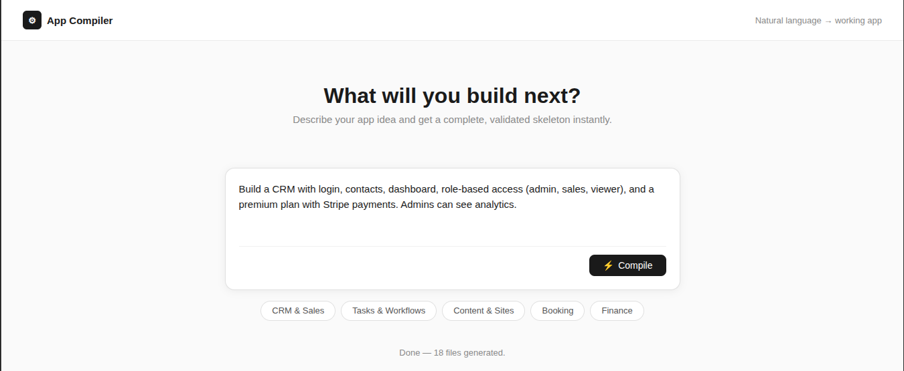
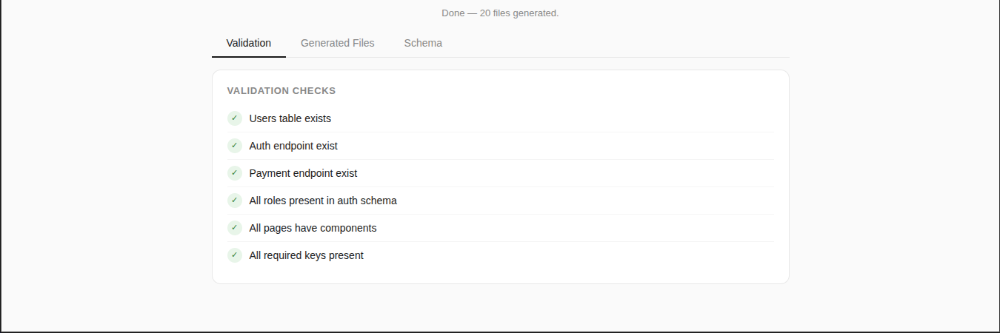
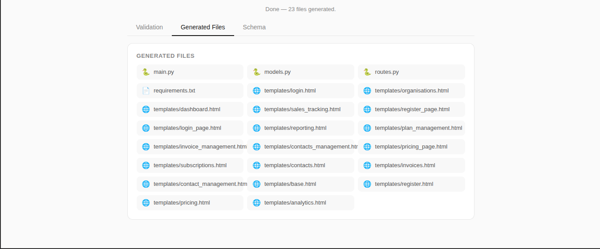
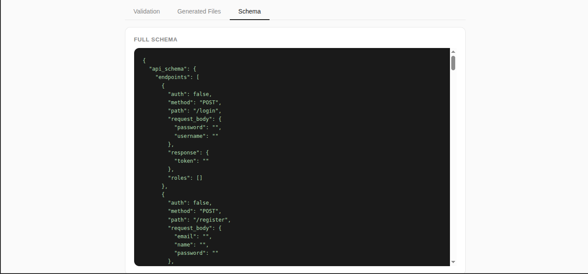

# Multi-Stage App Generation System

> Describe your app idea in plain English → get a complete, validated app skeleton in seconds.

Building a new app idea requires hours of planning — database schema, API design, system architecture, page structure. This project automates all of it through a 5-stage AI pipeline that takes a natural language prompt and produces a ready-to-run Flask application.

---

## Demo

### Input


### Validation Results


### Generated Files


### Schema Output


---

## How It Works

Most AI code tools send one giant prompt and hope for the best. This system works like a compiler — breaking the problem into discrete, validated stages where each stage has a strict input/output contract.

```
"Build a CRM with login, contacts, dashboard, role-based access, and payments"
                              ↓
              ┌───────────────────────────┐
              │   Stage 1: Intent         │  Extracts app name, features,
              │   Extraction              │  roles, entities, assumptions
              └────────────┬──────────────┘
                           ↓
              ┌───────────────────────────┐
              │   Stage 2: System         │  Generates pages, routes,
              │   Design                  │  auth strategy, permissions
              └────────────┬──────────────┘
                           ↓
              ┌───────────────────────────┐
              │   Stage 3: Schema         │  Produces UI, API, DB, and
              │   Generation              │  auth schemas simultaneously
              └────────────┬──────────────┘
                           ↓
              ┌───────────────────────────┐
              │   Stage 4: Validation     │  Runs 6 deterministic checks,
              │   + Repair Engine         │  auto-repairs inconsistencies
              └────────────┬──────────────┘
                           ↓
              ┌───────────────────────────┐
              │   Stage 5: Code           │  Generates a running Flask app
              │   Generation              │  from the validated schema
              └───────────────────────────┘
                           ↓
              ┌───────────────────────────┐
              │   Generated App           │  models.py, routes.py,
              │                           │  templates/, main.py
              └───────────────────────────┘
```

---

## Pipeline Stages

### Stage 1 — Intent Extraction
Parses the natural language prompt into a structured JSON object containing app name, type, core features, user roles, entities, and any assumptions made for vague inputs.

### Stage 2 — System Design
Converts intent into an architecture — pages with routes and components, role-based permission matrix, auth strategy, payment flow, and third-party integrations.

### Stage 3 — Schema Generation
Generates four cross-consistent schemas simultaneously:
- **UI Schema** — components mapped to pages
- **API Schema** — endpoints with auth rules and role restrictions
- **DB Schema** — tables, columns, types, and relations
- **Auth Schema** — strategy, roles, and permissions

### Stage 4 — Validation + Repair Engine
Runs deterministic checks across all layers and surgically repairs issues rather than retrying blindly:

| Check | Action if Failed |
|---|---|
| Users table exists in DB | Injects users table |
| Auth endpoints present | Injects /login endpoint |
| Payment endpoints present | Injects /subscriptions endpoint |
| All roles covered in auth schema | Adds missing roles |
| All pages have components | Flags for review |
| All required schema keys present | Flags for review |

### Stage 5 — Code Generation
Translates the validated schema into actual files using deterministic templating — no AI needed at this stage because the schema is structured enough to generate code directly.

**Generated files:**
```
generated_app/
├── main.py            # Flask server with DB initialization
├── models.py          # SQLAlchemy models from db_schema
├── routes.py          # API endpoints with auth decorators
├── requirements.txt   # Dependencies
└── templates/
    ├── base.html      # Base layout
    ├── login.html     # One HTML page per schema page
    ├── dashboard.html
    └── ...
```

---

## Reliability Design

**Why multiple stages?**
Each stage has a strict JSON output contract. Failures are isolated — if Stage 3 fails, only Stage 3 is retried, not the entire pipeline.

**JSON repair:**
Every stage wraps responses with a `clean_json()` utility that strips markdown fences before parsing. Parse failures trigger targeted retries with tighter prompts.

**Cross-layer consistency:**
The Stage 3 system prompt enforces that API endpoint fields must match DB columns, and UI components must map to pages from Stage 2. Stage 4 verifies this deterministically.

---

## Tech Stack

| Layer | Technology |
|---|---|
| Pipeline | Python 3.12 |
| LLM | Groq API (Llama 3.3 70B) |
| Backend | Flask + Flask-CORS |
| Database ORM | Flask-SQLAlchemy |
| Frontend | Vanilla HTML, CSS, JavaScript |

---

## Running Locally

**1. Clone the repo**
```bash
git clone https://github.com/yourusername/app-compiler
cd app-compiler
```

**2. Create and activate virtual environment**
```bash
python -m venv venv
source venv/bin/activate  # Windows: venv\Scripts\activate
```

**3. Install dependencies**
```bash
pip install -r requirements.txt
```

**4. Set up environment variables**

Create a `.env` file:
```
GROQ_API_KEY=your_groq_api_key_here
```

Get a free API key at [console.groq.com](https://console.groq.com)

**5. Run the backend**
```bash
python app.py
```

**6. Open the frontend**

Open `index.html` in your browser and start compiling.

---

## Example

**Input:**
```
Build a CRM with login, contacts, dashboard, role-based access, 
and premium plan with payments. Admins can see analytics.
```

**Output:**
- 5-page application (Login, Register, Dashboard, Contacts, Pricing)
- 7 API endpoints with role-based auth
- 4 database tables (users, contacts, invoices, subscriptions)
- Running Flask server with SQLAlchemy models
- HTML templates for every page

---

## Project Structure

```
app-compiler/
├── utils.py              # Shared Groq client and JSON utilities
├── stage1_intent.py      # Intent extraction
├── stage2_design.py      # System design generation
├── stage3_schema.py      # Schema generation
├── stage4_validator.py   # Validation and repair engine
├── stage5_generator.py   # Code generation
├── pipeline.py           # Pipeline orchestration
├── app.py                # Flask API server
├── index.html            # Frontend interface
└── requirements.txt      # Dependencies
```